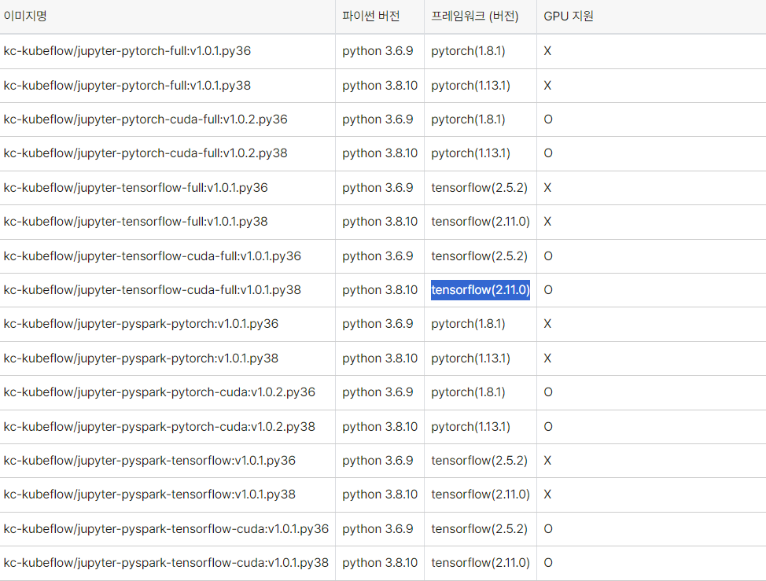

# custom이미지 활용

커스텀 이미지를 활용 하기 위해선 base 이미지를 주피터랩 계열을 써야한다.

<figure><figcaption></figcaption></figure>

<figure><figcaption></figcaption></figure>

```
//노트북 빌드를 위한 Dockerfile 코드 예제

    ARG BASE_IMG=<bigdata-150.kr-central-2.kcr.dev/kc-kubeflow/jupyter-pytorch-full:v1.0.1.py38>
    FROM $BASE_IMG

    ARG PYTHON_VER=38
    ARG FRAMEWORK_TYPE=38

    ENV DEBIAN_FRONTEND=noninteractive

    USER $NB_UID

    # 
    # *** YOUR CUSTOM DOCKER CODE HERE ***
    # 

    COPY --chown=jovyan:users requirements.txt /tmp/requirements.txt

    RUN python3 -m pip install --upgrade pip --quiet \
        && python3 -m pip install -r /tmp/requirements.txt --no-cache-dir \
        && rm -f /tmp/requirements.txt
    # INSTALLABLE PYTHON PACKAGES IN requirements.txt
```


사용하려는 이미지의 파이토치 혹은 텐서플로 그리고 파이썬 버전과 호환되는 라이브러리를 반듯이 체크한다.( chat gpt 활용하면 편하다)


````
// requirements.txt

```pip-requirements
pandas==2.0.3
scikit-learn==1.2.2
keras==2.11.0
numpy==1.24.4
matplotlib==3.7.5
seaborn==0.12.2

```
````

그다음 이미지를 빌드한다.

```
docker build -t my-custom-jupyterlab:latest .
```


그다음 도커 허브에 업로드한다.

#### 단계별 가이드

1. **Docker Hub 로그인**

먼저, Docker Hub에 로그인해야 합니다. 이를 위해 터미널에서 다음 명령어를 실행합니다:

```
docker login
```

프롬프트가 나타나면 Docker Hub의 사용자 이름과 비밀번호를 입력합니다.


2. **이미지 태그**

Docker Hub에 이미지를 푸시하기 전에 이미지를 적절한 이름으로 태그해야 합니다. 예를 들어, `my-custom-jupyterlab`이라는 이미지를 `myusername/my-custom-jupyterlab:latest`로(hub 레포) 태그하려면 다음 명령어를 사용합니다:

```
docker tag my-custom-jupyterlab:latest myusername/my-custom-jupyterlab:latest
```

여기서 `myusername`을 Docker Hub 사용자 이름으로 변경합니다.


3. **이미지 푸시**

이제 태그된 이미지를 Docker Hub에 푸시할 수 있습니다:

```
docker push myusername/my-custom-jupyterlab:latest
```

이 명령어는 이미지를 Docker Hub에 업로드합니다.


#### 추가 팁

* **Docker Hub에서 리포지토리 생성**: Docker Hub 웹사이트에서 리포지토리를 미리 생성할 수도 있지만, 이미지를 푸시할 때 자동으로 생성됩니다.
* **다양한 태그 사용**: 동일한 이미지를 여러 버전으로 관리하려면 다양한 태그를 사용할 수 있습니다. 예를 들어, `:v1.0`과 같은 태그를 사용하여 특정 버전을 푸시할 수 있습니다.

```
docker tag my-custom-jupyterlab:latest myusername/my-custom-jupyterlab:v1.0
docker push myusername/my-custom-jupyterlab:v1.0
```
